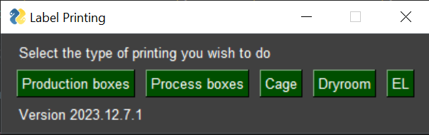

# Zebra Printing

<!--  -->

## About

This project is intended to meet the requirements of PEP-518 and PEP-621, removing the setup.py file and having only minor use of setup.cfg (intended at this time only for flake8 support)

## Contents

- [Zebra Printing](#zebra-printing)
  - [About](#about)
  - [Contents](#contents)
  - [Requirements](#requirements)
  - [Installation - Windows](#installation---windows)
  - [Installation - Mac](#installation---mac)
  - [Use](#use)
  - [ToDo](#todo)

## Requirements

Python 3.10+ is the currently supported version.
If you wish to change this, you may use any version >3.7, but if you plan to edit, the version of python must be updated in the pyproject.toml in the "target_version" under tool.black

## Installation - Windows

Project has been updated to utilize an executable gui.
Installation is the download of the executable.

## Installation - Mac

Executable does not work for mac, and there is no support for Mac yet planned.

## Use

Download the .exe file and run
Executable is under dist/all_label_gui.exe

## ToDo

- [x] V1/V2 cells stored differently, need alt query
- [x] Add EL label printing
- [x] Simpler installation guide? Add python installation descriptions & figure out how to do it not using VSCode
- [x] Separate dryroom & cage printing
- [ ] Clearer labels for functions
- [ ] Simplify the way to get the item check (SQL query)?
- [x] Removed large file check, allow application to be easily downloaded
